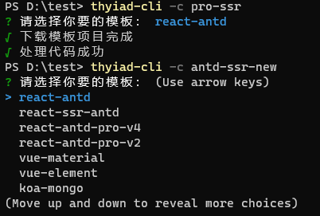

# thyiad-cli

一键快速创建新项目😏

- 选择困难症救星
- 所有项目都可以直接run起来预览
    > 使用了自建的在线mock：https://easymock.thyiad.top

目前提供以下模板：
> 代码规范都基于 husky + eslint + prettier + pretty-quick + commitlint

- react-ui-lib
    > rollup + typescript 开发 react 组件库
- ts-lib
    > typescript 开发工具库
    > 不使用 webpack 等构建工具
- vite-antd-spa、vite-zarm-spa
    > 基于 vite 的基础仓库
    > react + typescript + hooks（context+useReducer代替了redux）
    > antd和zarm分别适用pc、mobile
    > 基于vite的ssr暂未添加
- react-antd、react-ssr-antd
    > 基于 webpack 从零配置的基础仓库
    > 分别是spa、ssr
    > react + typescript+react-router+antd+hooks（context+useReducer代替了redux）
- react-antd-pro-v4、react-antd-pro-v2
    > 基于ant design pro的基础仓库，不建议使用了
    > 分别对应 antd pro v4.0、v2.0
    > ts+react+react-router+redux+antd+hooks+umi+dva（v2.0没有hooks）
- vue-material
    > 基于vue cli 3.0
    > js+vue+vue-router+vuex+vue-material
    > vue-material 好看。。
- vue-element
    > 基于vue cli 2.0
    > js+vue+vue-router+vuex+element ui
- gin-mongo
    > gin + mongodb + redis + jwt
    > 尚未全部完成
- koa-mongo
    > koa2 + typescript + mongodb + redis + jwt
- net-core-webapi
    > .net core 3.1 webapi

计划添加的：
- [ ] [fluentui](https://github.com/microsoft/fluentui)

### 使用

``` bash
npm install -g @thyiad/cli

thyiad-cli -c projectName
```



> 当时为了下载速度，代码存放在gitee上，需要先配置好 gitee 的 ssh 才能正常下载
> 如果出现代码下载失败，可以自行前往gitee.com下载，项目名均为pt-【name】
> react-antd和react-ssr-antd在github上也有仓库，地址为 https://github.com/thyiad/react-ssr

### react-antd


### react-ssr-antd
同 react-ant

### react-antd-pro-v4


### react-antd-pro-v2
同 react-antd-pro-v4

### vue-material


### vue-element


